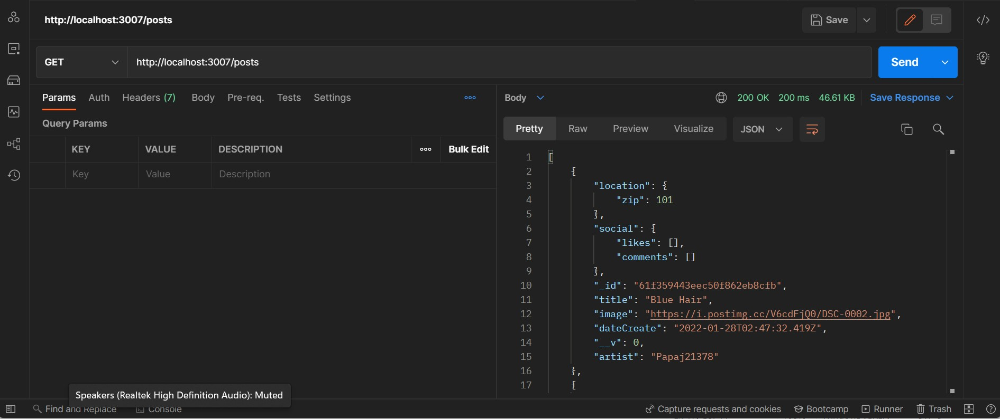
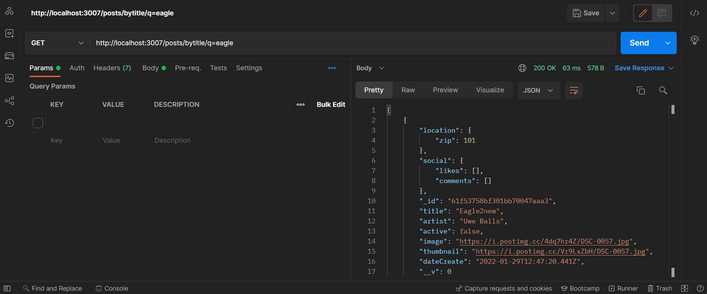

# Reykjavik Street Art REST API

The Reykjavik Street Art REST API allows you to create, read, update, delete and search in a database of street arts found in Reykjavik.

## URL

Base URL: localhost:3007/
<br/>
End points: `/posts`

## API Key

The API key need to be passed into the API as a URL parameter access_key. <br/>
`*****`

## Method

`GET` | `POST` | `DELETE` | `PATCH`

## Get all street art

`GET` `'/'`

### Example:

`GET` `http://localhost:3007/posts`

### Response:

```[
    {
        "location": {
            "zip": 101
        },
        "social": {
            "likes": [],
            "comments": []
        },
        "_id": "61f359443eec50f862eb8cfb",
        "title": "Blue Hair",
        "image": "https://i.postimg.cc/V6cdFjQ0/DSC-0002.jpg",
        "dateCreate": "2022-01-28T02:47:32.419Z",
        "__v": 0,
        "artist": "Papaj21378"
    },

	...
]
```



## Get street art by id

`GET` `/byid/:id`

### Example:

`GET` `http://localhost:3007/posts/byid/61f359443eec50f862eb8cfb`

### Response:

```{
    "location": {
        "zip": 101
    },
    "social": {
        "likes": [],
        "comments": []
    },
    "_id": "61f359443eec50f862eb8cfb",
    "title": "Blue Hair",
    "image": "https://i.postimg.cc/V6cdFjQ0/DSC-0002.jpg",
    "dateCreate": "2022-01-28T02:47:32.419Z",
    "__v": 0,
    "artist": "Papaj21378"
}
```


## Get street art by title

`GET` `/bytitle/q=:title`

### Example:

`GET` `http://localhost:3007/posts/bytitle/q=eagle`

### Response:

```[
    {
        "location": {
            "zip": 101
        },
        "social": {
            "likes": [],
            "comments": []
        },
        "_id": "61f53758bf301bb70047aaa3",
        "title": "Eagle2new",
        "artist": "Uwe Balls",
        "active": false,
        "image": "https://i.postimg.cc/4dq7hr4Z/DSC-0057.jpg",
        "thumbnail": "https://i.postimg.cc/Vr9LxZbH/DSC-0057.jpg",
        "dateCreate": "2022-01-29T12:47:20.441Z",
        "__v": 0
    }
]
```



## Add a new street art

`POST` `'/'`

### Example:

`POST` `http://localhost:3007/posts`

Content-Type: `application/json`

### Request:

```{
"title": "Ha",
"artist": "Unknown",
"image": "https://img.theculturetrip.com/wp-content/uploads/2017/07/dsf0384.jpg",
"street": "Laugavegur",
"active":false
}
```


## Upadate existing street art

The posts are updated by id.

`PATCH `'/:id'`

### Example:

`PATCH` `http://localhost:3007/posts/61fac9d89887140774832f09`

Content-Type: `application/json`

Request:

```{
"artist": "Seeb"
}
```


## Delete existing street art

The posts are deleted by id.

`DELETE` `'/:id'`

### Example:

`DELETE` `http://localhost:3007/posts/61f9d2269711698300cb80b0`


## Error codes

`404` Not found </br>
`303` Duplicate </br>
`200` OK

## Schemas

### Streetarts Model

```title: {
        type: String
        },
    artist: {
            type:String
        },
    year: {type:Number
        },
    active: {type:Boolean
        },
    image: {type: String,
            required:[true,"image url required"],
            unique: true
        },
    thumbnail: {type:String
        },
    location: {
            zip:{type:Number,
                required:true,
                default:101
            },
            street:{type: String
            },
            coordinates:{
                longitude:{type:Number
                },
                latitude:{type:Number
                }
            }
        },

    social: {
            originalPoster:{type:String
            },
            likes:{type:[String],
                default:[]
            },
            comments:{type:[Object],
                default:[]            }
        }},{
            timestamps: true,
            collection: 'streetarts'
         }
```

### Users Model

```username:{
      type: String,
      required: [true,'Please enter the username'],
      unique:[true, 'This username is already in use']
   },
   email: {
      type: String,
      required: [true,'Please enter the email'],
      unique:[true,'This email is already in use'],
      lowertcase:true,
      validate: [isEmail, 'Please enter a valid email ']
   },
   password: {
      type: String,
      required: [true,'Please enter the username'],
      minlength : [6, 'Minimum password length is 6 characters']
   }
},{
   timestamps: true,
   collection: 'users'
})
```
